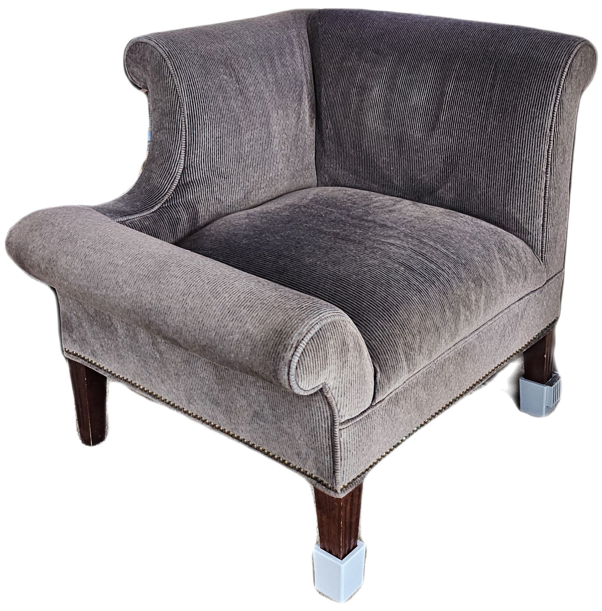
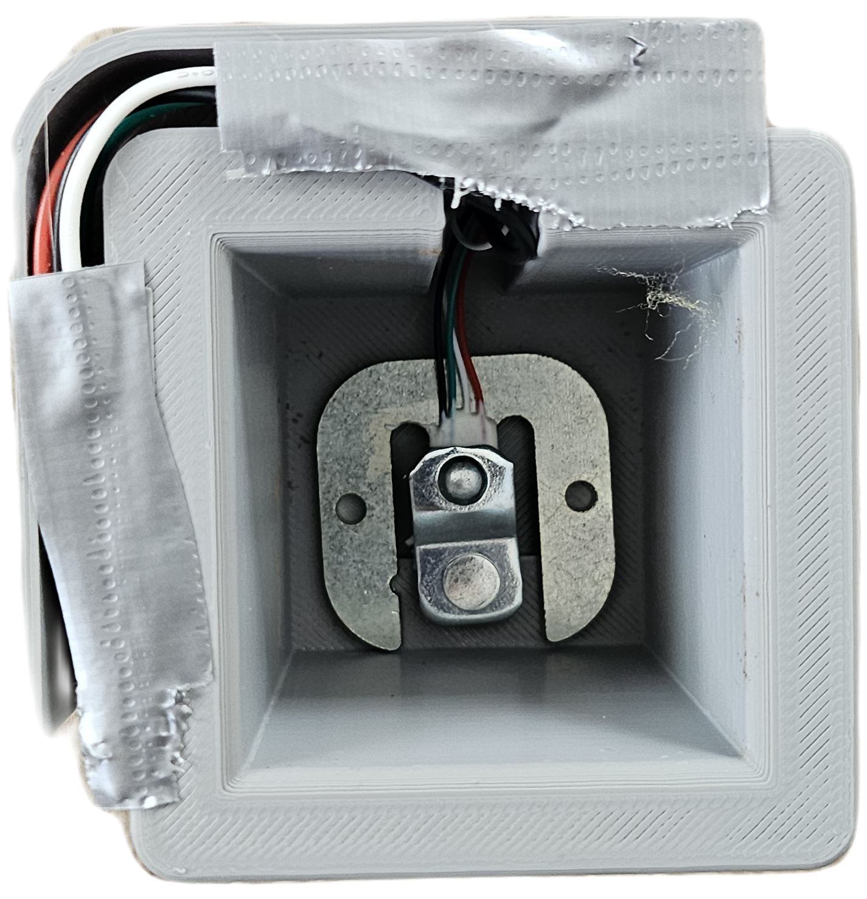
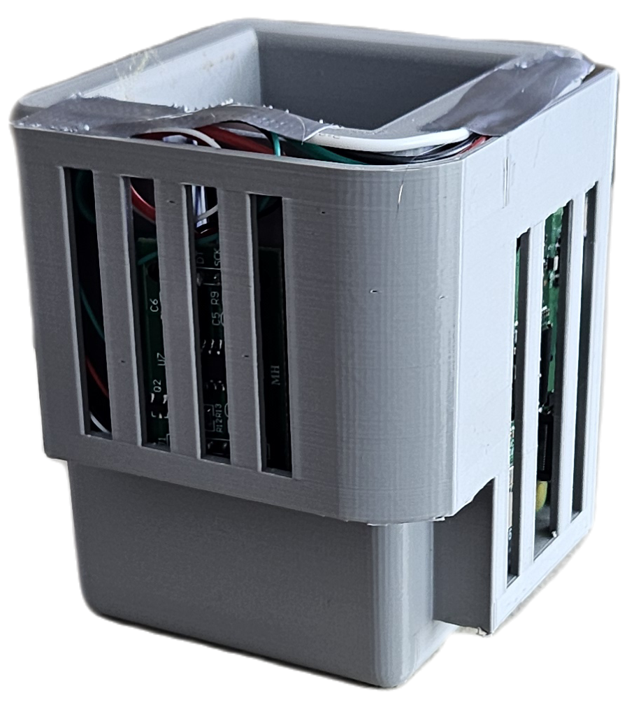
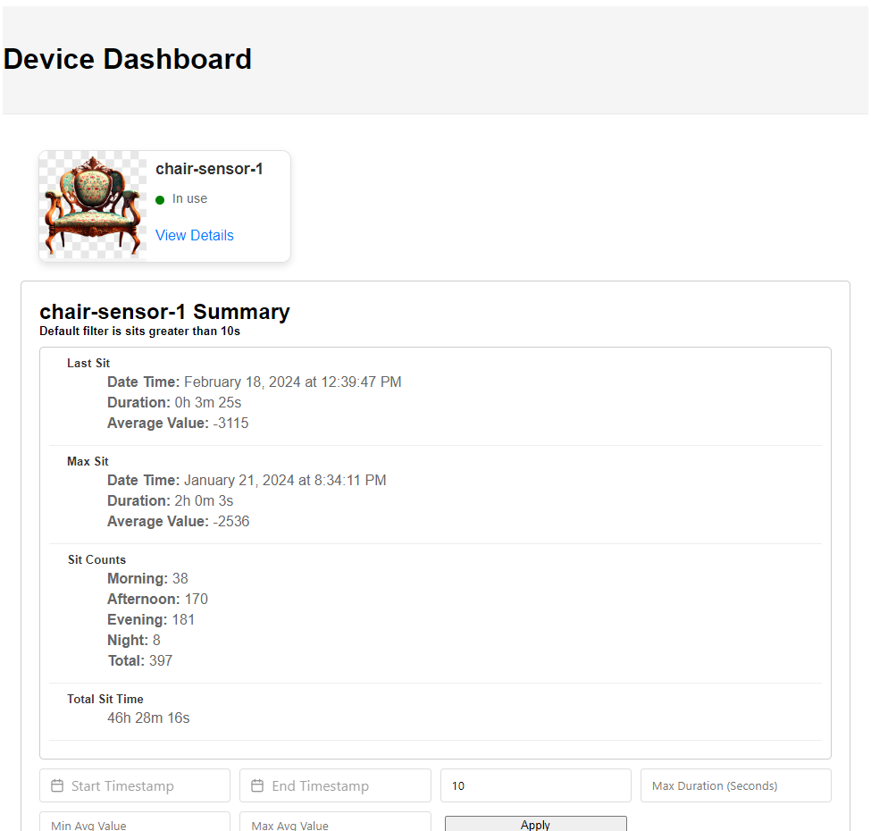

<!-- Text can be **bold**, _italic_, or ~~strikethrough~~. -->

# Welcome!

You've reached my projects page, going forward I'm going to attempt to detail the silly projects that I come up with here. Currently interested in Kafka and event driven architecture... Also load cells of course.

Obligitory [About Me](./about-me.html) page for those who care.

## Load Cells and Kafka: A Match Made in Heaven. 

Recently I've been really interested in load cells and how they operate. One thing led to another and now I have a sensor for my living room chair and an unimaginable amount of data surrounding that chair.
Leading me to think about applicable use cases. This project is designed with scale in mind, more sensors to come...

_The Chair™️_ -isn't it beautiful.

### Overview:

- **Chair Sensor: Device to read and send data**

  
  
  - [Link to Repo](https://github.com/DevinMB/LoadCell-Kafka/blob/master/chair_v4.py)
  - **Description:** Yes that's duct tape, yes I need to 3D print a top. I created a small foot for my chair that houses a Rasberry PI, HX711 and a load cell. Forking from the HX711 sensor amplifier repo, I created a simple script to read input values and send an events to a raw sit topic. 

- **Light Controller: Because why not**
  - [Link to Repo](https://github.com/DevinMB/sit-light-controller)
  - **Description:** This repository focuses on controlling the lights based on actions recieved in the raw sit topic. If a sit down is recieved it will turn on the light behind the chair, light will dim when you get up as well. 

- **Sit Record Producer: taking two records to make a sit event**
  - [Link to Repo](https://github.com/DevinMB/LoadCell-Kafka/blob/master/kafka_sit_producer_v2.py)
  - **Description:** This consumer of the raw sit topic takes in a sit down event and a sit up event to generate a Sit event. This sit event contains things like avg value (weight), timestamp for start and end of sit, duration, and a few other things. 

- **Device Status Stream: makes the status of a device available to consumers**
  - [Link to Repo](https://github.com/DevinMB/device-status-stream)
  - **Description:** This consumer of the raw sit topic takes in a sit down event and a sit up event to device status messages. These messages will be used in getting the current status of a device at any given time. (used in dashboard)

- **Sit Stats API: provides all sorts of sit data to consumers**
  - [Link to Repo](https://github.com/DevinMB/sit-stats-api)
  - **Description:** This consumer of the sit topic aggregates all sits and provides endpoints to get information on a device. As well it also consumes from the device status topic. As well as a restful API this application also exposes web sockets for providing a live update of device status's to its consumers.

- **Sit Stats Dashboard: A UI for all this data!**
  - [Link to Repo](https://github.com/DevinMB/sit-stats-dashboard)
  - **Description:** I'm terrible at front end, but this UI was created in Vue.js and consumes from the web sockets provided by the Sit Stats API. Lets you filter by avg value, time of sit, and duration of sit. Clicking on a device opens the additional details and filters, otherwise device will only show a status of in use/not in use. 
  - It look like this:
    

## Whisper Bot: ML Kafka Pipelines are Cool

My friends and I have an anonomous chat that is for memes. With about 30 people in this chat and a constant flow of data, I felt this would be a good use case for kafka and machine learning. 
The bot consumes whispers and tries to make an impactful message to the group once a day. The results are silly, but the pipeline behind it was very fun to implement.
In future releases I'd like to use reactions to it's messagse as sentiment in the next model. Or use a LLM like LLAMA 2 or something. We shall see!

### Overview:

- **Whisper Consumer: Logs all text messages**
  - [Link to Repo](https://github.com/DevinMB/whisper-consumer)
  - **Description:** Leveraging the Telegram bot API, this application consumes messages sent to our anonomous group and produces to a raw message topic.

- **Whisper training set producer: Cleans up the data**
  - [Link to Repo](https://github.com/DevinMB/whisper-text-training-set-producer)
  - **Description:** This application focuses on cleaning up all the messages in the raw message topic, making sure they are ready for training and then sending to a training set topic.

- **Whisper model generator: Uses the data to make a model**
  - [Link to Repo](https://github.com/DevinMB/whisper-text-trainer)
  - **Description:** Consuming all the cleaned messsages, this application uses Tensorflow to build a model on the data provided, then converts this model into a TFlite file (smaller/more portable) and sends it to a model topic. 

- **Whisper text generator: API that uses the model to generate text**
  - [Link to Repo](https://github.com/DevinMB/whisper-text-generator)
  - **Description:** This application looks for the most recent model in the topic and loads it, given a seed text and number of words this API can generate sentences (poorly) based of the model. When a new model comes in, the new model is loaded.

- **Whisper text sender: Uses the API on a schedule**
  - [Link to Repo](https://github.com/DevinMB/whisper-text-send-bot/tree/main)
  - **Description:** This application schedules a whisper to be sent once a day using the new model.

- **Whisper LLAMA2 Text Generation: We getting serious here**
  - [Link to Repo](https://github.com/DevinMB/whisper-ollama-message-generator)
  - **Description:** This application utilizes a LLAMA2 model, I'm embedding each message and using the embeded vectors to generate messages.

